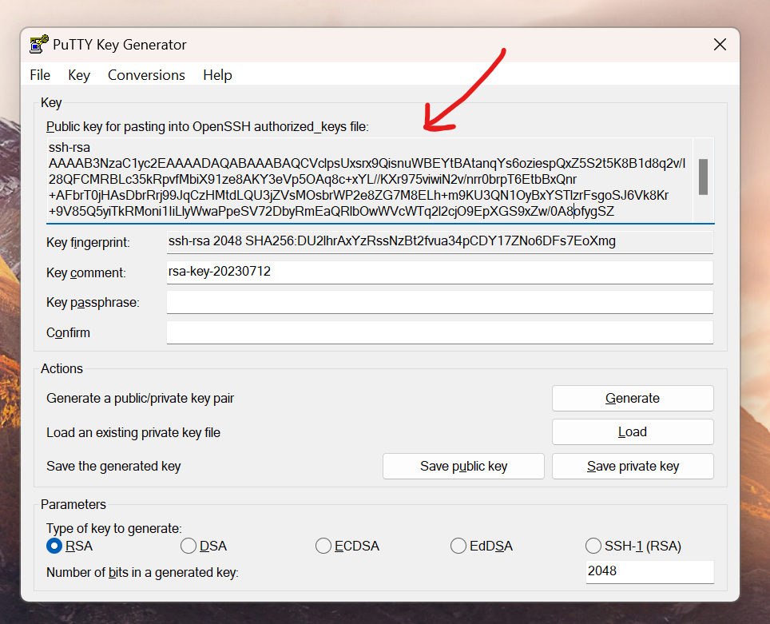

# Single-User Modified Atmoz/sftp container for use inside Azure Container Instance
This repository contains a modified version of the original Atmoz/sftp Docker container, configured for single user "usruser" usage with private key authentication and a permanent host key setup. It also contains a increase for the maximum amount of concurrent connections. The modifications and tweaks are done to let this run smooth and securely in Azure Container Instances.

## Modifications
1. **Single User Configuration:** This modification configures the SFTP service for a single user named "ursuser".
2. **Private Key Authentication:** Instead of using password-based authentication, this modification employs a more secure private key authentication method.
3. **Permanent Host Key:** To increase the reliability and security of the SSH connection and prevent MITM attacks, a permanent host key has been set up. This is nesecarry for running in Azure Container Instances where the container is recreated frequentlently. 
4. **Increase of concurrent connections** To allow mutliple processes to connect to this SFTP at once, we have increased the amount of allowed connections.

## Getting Started

### Prerequisites
- Docker 
- Keys

### Generate keys

#### Host keys
The **private** host keys are placed inside `hostkeys`. 

You can generate them using (bash and OpenSSH):
```bash 
ssh-keygen -t ed25519 -f keys/ssh_host_ed25519_key < /dev/null
ssh-keygen -t rsa -b 4096 -f keys/ssh_host_rsa_key < /dev/null
```

#### Authentication keys
Generate your keys using putty-gen and place the **public** keys inside a file in the `keys` directory.




### Build
⚠️⚠️ Be carefull when building the Docker image on Windows with **Windows line endings**. The docker container expects file endings to be LF and will break with cryptic errors on CRLF line endings. ⚠️⚠️ You can use the dos2unix program to fix these, just do a `dos2unix -R .` and all files should be unix line endings again.

```bash
docker build -t <your_image_name> .
```

### Usage
To run the container, use the following command:

```bash
docker run -d -p 22:22 <your_image_name>
```

Connect with your SFTP client (WinSCP or Filezilla) using the following settings:

* **Host**: localhost
* **Port**: 22
* **Username**: ursuser
* **Password**: leave blank and setup the **private** key in the client settings

## Deploy to Azure

## Preqrequisites

* A resource group to hold everything
* An Azure Container Registry 
* An Azure Storage account
* An Azure File Share inside this Storage account

## Configurate ARM template
Copy the ARM template to arm-deploy.yml and fill in the following vairables:
* **<name_of_container>**: the name of the container, can be any name and will appear in Azure accordingly
* **<your_azure_container_registry_name>**: the name of your Azure Container Registry, needs to exist on Azure
* **<your_image_name>**: name you gave the image when you build it in Docker
* **<acr_username>**: retrievable from the Access keys menu in your container registry
* **<acr_password>**: retrievable from the Access keys menu in your container registry
* **<dns_alias>**: any alias, will be used as subdomain and used to connect to the container
* **<azure_share_name>**: name of the File Share, it needs to exist and be created in Azure under the right storage account
* **<storage_account_name>**: name of the Azure Storage account where the File Share exists
* **<storage_account_key>**: access key, you can find this in the Storage account under Access Keys
 

## Deploy
For more info check: https://learn.microsoft.com/en-us/azure/container-registry/container-registry-get-started-docker-cli?tabs=azure-cli

1. Login to Azure using the Azure CLI
   ```bash
   az login
   ```

2. Login to ACR:

   ```bash
   az acr login -n <your_azure_container_registry_name>
   ```

3. Build your Docker image:

   ```bash
   docker build -t <your_azure_container_registry_name>/<your_image_name> .
   ```

4. Push your Docker image to ACR:

   ```bash
   docker push <your_azure_container_registry_name>/<your_image_name>
   ```

5. Create an Azure Container Instance:
   ```bash
   az container create -g <your_resourcegroup> -f arm-deploy.yml
   ```
If the deployment succeeded, you can now use your SFTP client to connect to the host _<dns_alias>.westeurope.azurecontainer.io_.
